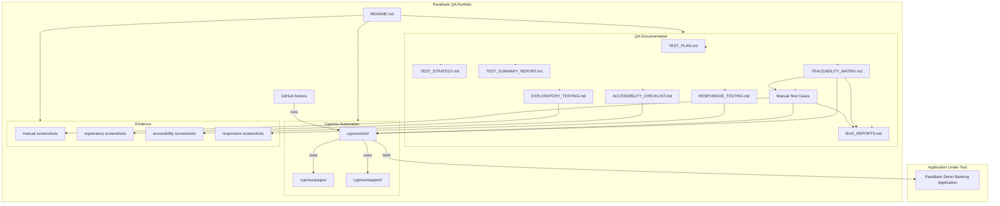

# ParaBank QA Portfolio Project

[](https://github.com/maririb749/ParaBank-QA-Project/actions/workflows/cypress.yml)

A practical QA portfolio project for a demo banking application, covering manual testing, Cypress automation, exploratory testing, accessibility smoke testing, responsive smoke testing, bug reporting, traceability, evidence management, and CI with GitHub Actions.

The project focuses on realistic QA work: identifying high-risk workflows, documenting defects clearly, collecting evidence, and mapping manual coverage to automated regression scenarios.

## What This Project Demonstrates

| Skill | How It Is Demonstrated |
|---|---|
| Manual QA | 15 documented test cases across core banking workflows |
| Cypress automation | 5 spec files mapped to 15 manual scenarios |
| Test architecture | Custom Cypress commands and Page Objects for authentication flows |
| Bug reporting | 3 documented bugs with severity, priority, impact, status, and evidence |
| Exploratory testing | 2 executed exploratory sessions focused on authentication and transfers |
| Accessibility testing | Smoke test executed for login usability, focus visibility, labels, errors, and link purpose |
| Responsive testing | Smoke test executed across desktop, tablet, and mobile viewports |
| Traceability | Requirements, test cases, bugs, automation, risks, and evidence mapped in a traceability matrix |
| CI/CD | GitHub Actions workflow running the Cypress regression suite |

## QA Project Architecture



## Application Under Test

| Item | Details |
|---|---|
| Application | ParaBank Demo Banking Application |
| URL | `https://parabank.parasoft.com/parabank/index.htm` |
| Type | Demo online banking web application |
| Tested Interface | Web UI |

ParaBank simulates common banking workflows including login, account opening, account balance review, transfers, transaction history, and customer profile updates.

## Execution Snapshot

| Area | Result |
|---|---|
| Manual functional test cases | 15 executed |
| Cypress automation | 5 spec files, 15 mapped scenarios |
| Latest Cypress result | 12 passing, 3 pending known bugs, 0 failing |
| Bugs documented | 3 |
| Total observations | 6 |
| Exploratory testing | 2 executed sessions |
| Accessibility testing | Smoke pass executed with evidence |
| Responsive testing | Smoke pass executed with evidence |
| CI | GitHub Actions workflow configured |
| Automation architecture | Custom commands + Page Objects for authentication flows |

## Tested Scope

| Module | Coverage |
|---|---|
| Authentication | Valid login, incorrect password, empty login fields |
| Accounts | Open new account, view account balance, restricted page access |
| Transfers | Valid transfer, negative amount, insufficient balance |
| Transactions | Transaction history, search by amount, new account transaction state |
| Customer Profile | Valid update, invalid phone format, empty required fields |
| Exploratory Testing | Authentication/session access and transfers |
| Accessibility Smoke | Login keyboard navigation, focus visibility, labels, login error message, link purpose |
| Responsive Smoke | Login page, login error message, and public navigation across desktop, tablet, and mobile viewports |

Scenario coverage includes positive, negative, boundary, edge case, access control, exploratory, accessibility smoke, responsive smoke, and regression-oriented testing.

## Risk-Based Testing Approach

Testing was prioritized around high-impact banking workflows:

- Authentication and session access
- Restricted page access
- Transfers and balance behavior
- Transaction history visibility
- Customer profile validation
- Error handling and validation feedback

This approach helped keep the test scope focused, realistic, and aligned with the main risks of the application.

## Key Findings

| ID | Finding | Current Status |
|---|---|---|
| BUG-001 | Incorrect password authentication was reproduced during manual testing. It was not reproduced during EXP-001 and remains Needs Retest. | Needs Retest |
| BUG-002 | Negative transfer amount was accepted and processed. | Open |
| BUG-003 | Insufficient balance transfer was accepted and created invalid balance behavior. | Open |
| OBS-003 | Browser Back after logout displayed cached authenticated account data, while protected actions still required login. | Observation |
| A11Y-OBS-001 | Login focus indicator is present but visually subtle. | Observation |
| RWD-OBS-002 | Mobile viewport keeps a reduced desktop-style layout instead of adapting to the screen width. | Observation |

Detailed bugs, observations, exploratory notes, and evidence are available in the documentation map below.

## Automation Overview

The Cypress project is located in [Automation/](Automation/).

| Automation Area | Details |
|---|---|
| Framework | Cypress |
| Test location | `Automation/cypress/e2e/` |
| Page Objects | `Automation/cypress/pages/` |
| Custom commands | `Automation/cypress/support/commands.js` |
| Test data strategy | Dynamic QA users are used during Cypress execution |
| Known-bug handling | TC-002, TC-008, and TC-009 are pending/skipped by default |
| CI | GitHub Actions runs the Cypress regression suite |

Cypress supports regression coverage, but it does not replace manual QA or exploratory thinking. Automated tests are mapped to documented manual test cases and keep known application bugs visible without causing the default regression run to fail.

## How To Run Cypress

All Cypress commands should be executed from the `Automation/` directory.

Install dependencies:

```bash
cd Automation
npm install
```

Run the default Cypress suite:

```bash
npm run cy:run
```

Run Cypress in Chrome:

```bash
npm run cy:run:chrome
```

Open Cypress interactively:

```bash
npm run cy:open
```

Run known-bug scenarios intentionally:

```bash
npm run cy:run:known-bugs
```

Additional spec-level scripts are available in [Automation/package.json](Automation/package.json).

## CI

GitHub Actions workflow exists at [.github/workflows/cypress.yml](.github/workflows/cypress.yml).

The workflow installs dependencies, runs the Cypress regression suite from the `Automation/` directory, and uploads Cypress screenshots and videos as artifacts when available.

The workflow status is displayed through the GitHub Actions badge at the top of this README.

## Documentation Map

This README is intentionally concise for portfolio review. Detailed QA artifacts are available below.

| Document | Purpose |
|---|---|
| [Test Plan](docs/TEST_PLAN.md) | Scope, objectives, environment, risks, execution approach, and deliverables |
| [Test Strategy](docs/TEST_STRATEGY.md) | Testing approach, risk prioritization, regression strategy, and automation strategy |
| [Manual Test Cases](docs/test-cases/PARABANK_15_TEST_CASES_EN.md) | 15 executable manual test cases with expected results, actual results, status, and evidence |
| [Bug Reports](docs/BUG_REPORTS.md) | Bugs, observations, severity, priority, impact, evidence, and retest notes |
| [Test Summary Report](docs/TEST_SUMMARY_REPORT.md) | Manual, Cypress, exploratory, accessibility, and responsive execution results |
| [Traceability Matrix](docs/TRACEABILITY_MATRIX.md) | Requirement, test case, bug, automation, risk, and evidence mapping |
| [Exploratory Testing](docs/EXPLORATORY_TESTING.md) | Exploratory charters, executed sessions, observations, and linked impact evidence |
| [Accessibility Checklist](docs/ACCESSIBILITY_CHECKLIST.md) | Accessibility smoke execution and future-scope checklist |
| [Responsive Testing](docs/RESPONSIVE_TESTING.md) | Responsive smoke execution and future-scope checklist |

## Evidence

| Evidence Area | Path | Status |
|---|---|---|
| Manual test screenshots | [evidences/screenshots/](evidences/screenshots/) | Evidence captured |
| Exploratory screenshots | [evidences/screenshots/exploratory/](evidences/screenshots/exploratory/) | Evidence captured |
| Accessibility screenshots | `evidences/screenshots/accessibility/` | Smoke evidence captured |
| Responsive screenshots | `evidences/screenshots/responsive/` | Smoke evidence captured |

Evidence file names include related test case, bug, observation, or exploratory session IDs so reviewers can trace claims back to screenshots quickly.

## Repository Structure

```text
ParaBank-QA-Project/
├── Automation/
│   ├── cypress/
│   │   ├── e2e/
│   │   ├── pages/
│   │   └── support/
│   └── package.json
├── docs/
│   ├── test-cases/
│   ├── ACCESSIBILITY_CHECKLIST.md
│   ├── BUG_REPORTS.md
│   ├── EXPLORATORY_TESTING.md
│   ├── RESPONSIVE_TESTING.md
│   ├── TEST_PLAN.md
│   ├── TEST_STRATEGY.md
│   ├── TEST_SUMMARY_REPORT.md
│   └── TRACEABILITY_MATRIX.md
├── evidences/
│   └── screenshots/
├── .github/
│   └── workflows/
└── README.md
```

## Tools Used

| Tool | Purpose |
|---|---|
| Cypress | UI regression automation |
| GitHub Actions | CI workflow for Cypress execution |
| Markdown | QA documentation, test cases, reports, and checklists |
| Chrome | Manual web testing and evidence capture |
| Chrome DevTools | Accessibility and responsive smoke checks |
| Git and GitHub | Version control, repository hosting, and portfolio presentation |
| Visual Studio Code | Editing QA documentation, Markdown files, Cypress tests, and project structure |
| Git Bash | Command-line Git and project workflow |
